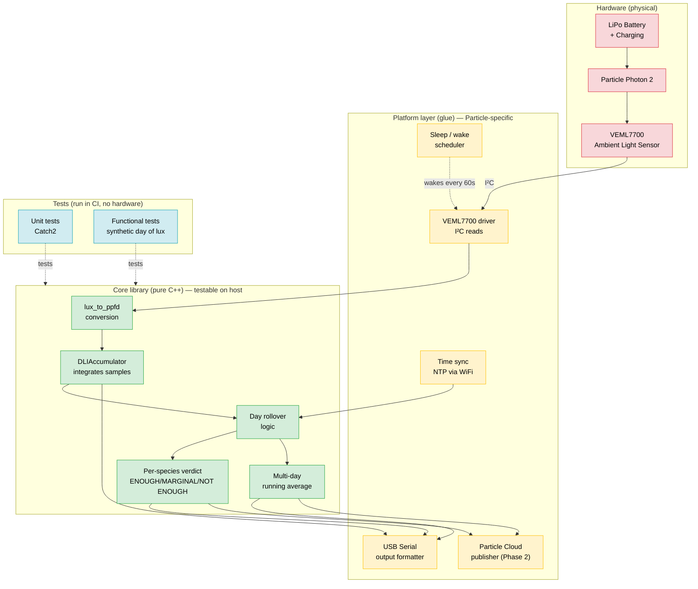

# Architecture

## Design principle

The firmware is split into two layers per PRD §12:

- **Core library** — pure C++, no hardware dependencies. Contains all "thinking" logic (math, accumulation, verdicts). Compiles and runs on a desktop host for unit testing in CI.
- **Platform layer** — thin "glue" code that talks to hardware (VEML7700 sensor, Particle Device OS, USB serial, cloud). Calls into the core to do real work.

This separation is what makes EP-3/EP-4/EP-5 (unit tests, functional tests, CI) possible without hardware in the loop.

## Block diagram

## Data flow (one sample cycle)

1. Sleep timer wakes the MCU every 60 seconds (configurable).
2. Platform driver reads lux from VEML7700 over I²C.
3. Lux passes into core `lux_to_ppfd()` → estimated PPFD.
4. PPFD and elapsed time pass into core `DLIAccumulator::add_sample()`.
5. Platform checks if local midnight has passed; if so, calls core `roll_over_day()` which freezes the day's DLI and starts a new one.
6. Platform formats and emits live reading over USB serial.
7. On day rollover or periodic summary cadence, platform calls core verdict logic and emits the human-readable summary.
8. MCU returns to sleep until next sample.

## Why this matters

If we wrote the firmware as one big `loop()` function that read the sensor, did the math, and printed serial all mixed together (the typical Arduino sketch shape), we couldn't unit-test any of it without a real Photon 2 and a real VEML7700 on a real I²C bus. By isolating the core, we can write tests that feed a synthetic day of lux readings into the accumulator and assert the resulting DLI and verdicts — entirely on a GitHub Actions Linux runner with no hardware. That's what EP-4 (functional tests) is asking for, and it's only possible with this split.
